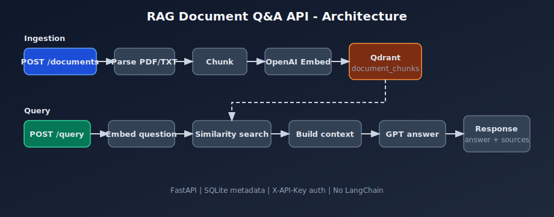
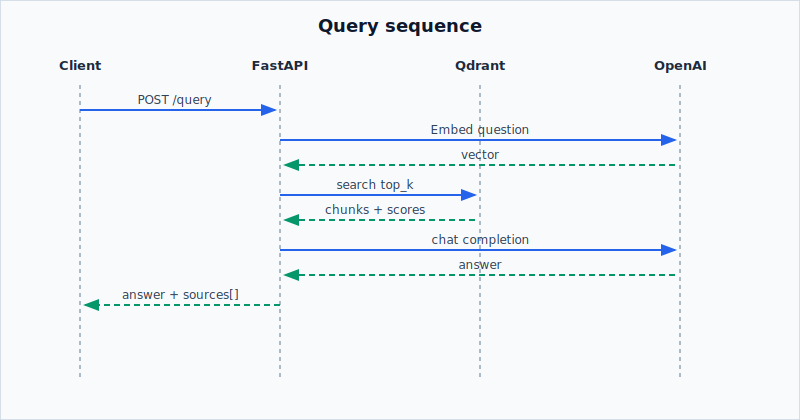
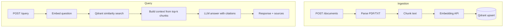

# RAG Document Q&A API

[](https://github.com/SparkScribe/rag-document-qa-api/actions/workflows/ci.yml)
[](https://www.python.org/downloads/)
[](LICENSE)

Production-style **Retrieval-Augmented Generation** API built with FastAPI, Qdrant, and OpenAI. Upload PDF or plain-text documents, embed chunks into a vector store, and answer questions with **source citations** — no LangChain.

**When to use RAG:** Use this pattern when answers must be grounded in your own documents rather than model parametric knowledge alone. Retrieval finds relevant passages at query time; the LLM synthesizes an answer from that context and returns traceable sources.

Built by [Ankit Vaghani](https://www.linkedin.com/in/ankit-vaghani/) · [SparkScribe Technologies](https://sparkscribetech.com)

---

## Architecture





<details>
<summary>Mermaid source (GitHub renders natively)</summary>



</details>

| Layer | Technology |
|-------|------------|
| API | FastAPI |
| Vector DB | Qdrant |
| Embeddings | OpenAI `text-embedding-3-small` (configurable) |
| LLM | OpenAI `gpt-4o-mini` (configurable) |
| Metadata | SQLite |
| PDF parsing | pypdf |
| Chunking | Custom recursive character splitter |

---

## Quick start

### Docker (recommended)

```bash
cp .env.example .env
# Set OPENAI_API_KEY in .env for live queries

docker compose up --build
```

API: http://localhost:8000  
Docs: http://localhost:8000/docs  
Health: http://localhost:8000/health

### Local development

```bash
python3.11 -m venv .venv && source .venv/bin/activate
pip install -e ".[dev]"

# Start Qdrant separately, or: docker compose up -d qdrant
export API_KEY=dev-api-key-change-me
export QDRANT_URL=http://localhost:6333
uvicorn app.main:app --reload
```

---

## Demo flow

```bash
export API_KEY=dev-api-key-change-me
export BASE=http://localhost:8000

# 1. Upload a document
curl -s -X POST "$BASE/api/v1/documents" \
  -H "X-API-Key: $API_KEY" \
  -F "file=@tests/fixtures/sample.txt" | jq

# 2. Query with citations
curl -s -X POST "$BASE/api/v1/query" \
  -H "X-API-Key: $API_KEY" \
  -H "Content-Type: application/json" \
  -d '{"question": "What is RAG?", "top_k": 5}' | jq

# 3. List documents
curl -s "$BASE/api/v1/documents" -H "X-API-Key: $API_KEY" | jq
```

**Example query response:**

```json
{
  "answer": "RAG combines document retrieval with language model synthesis...",
  "sources": [
    {
      "document_id": "uuid",
      "chunk_index": 0,
      "score": 0.89,
      "excerpt": "Retrieval-Augmented Generation (RAG) combines..."
    }
  ],
  "model": "gpt-4o-mini"
}
```

---

## API reference

Base path: `/api/v1`  
Auth: `X-API-Key` header (value from `API_KEY` env var)

| Method | Path | Description |
|--------|------|-------------|
| `GET` | `/health` | Health check (public, includes Qdrant status) |
| `POST` | `/api/v1/documents` | Upload PDF or TXT (max 5 MB) |
| `GET` | `/api/v1/documents` | List documents |
| `GET` | `/api/v1/documents/{id}` | Document metadata + chunk count |
| `DELETE` | `/api/v1/documents/{id}` | Delete document and vectors |
| `POST` | `/api/v1/query` | Ask a question with source citations |

---

## Configuration

| Variable | Default | Description |
|----------|---------|-------------|
| `API_KEY` | `dev-api-key-change-me` | Client API key (`X-API-Key` header) |
| `OPENAI_API_KEY` | — | Required for embeddings and chat at runtime |
| `OPENAI_EMBEDDING_MODEL` | `text-embedding-3-small` | Embedding model |
| `OPENAI_CHAT_MODEL` | `gpt-4o-mini` | Chat model for answers |
| `QDRANT_URL` | `http://localhost:6333` | Qdrant HTTP endpoint |
| `DATABASE_URL` | `sqlite:///./data/rag.db` | Document metadata store |
| `MAX_UPLOAD_MB` | `5` | Max upload size |

See [`.env.example`](.env.example) for the full list.

---

## Testing

Unit tests mock OpenAI and Qdrant — **no API key required in CI**.

```bash
# Unit tests only (default in CI)
pytest tests -m "not integration" -v

# With coverage
pytest tests -m "not integration" --cov=app --cov-report=term-missing

# Optional integration tests (requires Qdrant running)
docker compose up -d qdrant
pytest tests -m integration -v
```

| Test area | Coverage |
|-----------|----------|
| Chunking | Recursive splitter, overlap, boundaries |
| Embeddings | Mocked OpenAI, missing key handling |
| Documents | Upload, list, delete, invalid file type |
| RAG query | Sources array, insufficient context |
| Auth | Missing/invalid API key → 401 |

---

## Project structure

```
rag-document-qa-api/
├── .github/workflows/ci.yml
├── app/
│   ├── api/v1/          # health, documents, query routes
│   ├── core/            # config, auth, error handlers
│   ├── db/              # SQLite models
│   ├── services/        # chunking, embedding, RAG, vector store
│   └── schemas/         # Pydantic request/response models
├── docs/images/         # Architecture diagrams
├── tests/               # Unit + optional integration tests
├── docker-compose.yml   # api + qdrant
└── Dockerfile
```

---

## Cost note

OpenAI API usage (embeddings + chat completions) is **billed to the operator** of this deployment. Monitor token usage via application logs (`INFO` level logs prompt/completion token counts).

---

## Disclaimer

This is a **sample implementation** for engineering demonstration and portfolio purposes. It is not intended as a legal, medical, or compliance-grade advice engine. Validate outputs and add domain-specific safeguards before production use.

---

## Related SparkScribe repositories

| Repository | Description |
|------------|-------------|
| [fastapi-production-api-starter](https://github.com/SparkScribe/fastapi-production-api-starter) | Production FastAPI template |
| [django-rest-api-starter](https://github.com/SparkScribe/django-rest-api-starter) | Django REST API starter |
| [django-saas-multitenant-api](https://github.com/SparkScribe/django-saas-multitenant-api) | Multi-tenant SaaS API patterns |
| [celery-task-pipeline](https://github.com/SparkScribe/celery-task-pipeline) | Background task processing |

---

## License

MIT — see [LICENSE](LICENSE).
